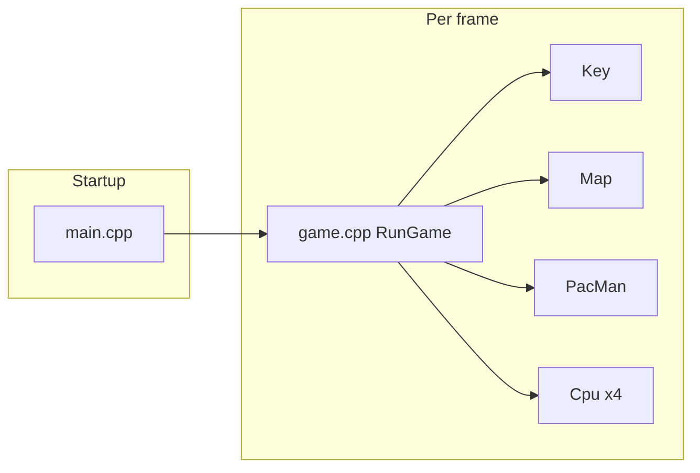

# Project guide: main files and how the game works

This document summarizes the **structure of the codebase** so you can explain it in a presentation or interview. For **graph-based autopilot and DFS**, see [AUTOPILOT.md](AUTOPILOT.md).

## Tech stack

- **Language:** C++11  
- **Graphics/audio:** [Raylib](https://www.raylib.com/) (headers under `lib/`, linked via `Makefile`)  
- **Build:** `Makefile` compiles all `.cpp` sources into `pac-man` or `pac-man.exe`

## High-level architecture

1. **`main.cpp`** opens the window, loads the map, positions entities, runs the **game loop** (`RunGame` each frame).  
2. **`RunGame`** (`game.cpp`) clears the screen, draws the maze, reads input, checks win/pause/death states, updates Pac-Man and ghosts, handles pellets/score/collisions, draws characters.  
3. **`Map`** holds walls, pellets, spawn points, lives UI positions, sounds, and timers for intro / death / win / game over.  
4. **`PacMan`** moves based on **`Key`** (arrows; autopilot uses **`A`** — see AUTOPILOT). **`Cpu`** subclasses Pac-Man with ghost AI and collision vs Pac-Man.

## Directory map

| Path | Purpose |
|------|---------|
| `src/main.cpp` | Entry point: init Raylib, create entities, main loop |
| `src/main.hpp` | Shared includes and declarations for `game.cpp`, `utils.cpp`, `pixels.cpp` |
| `src/game.cpp` | `RunGame`, `GameStatus` — frame logic and state machine |
| `src/utils.cpp` | `StartTimer` / `TimerDone`, `SetDefaultPositions`, `DrawPlayers`, etc. |
| `src/pixels.cpp` | Low-level pixel drawing for Pac-Man mouth shapes (`DrawUpMouth`, …) |
| `src/Map/Map.hpp`, `Map.cpp` | Load `maps/map.txt`, draw maze/pellets/lives, expose graph for autopilot |
| `src/PacMan/PacMan.hpp`, `PacMan.cpp` | Player movement, scoring, collision with walls |
| `src/PacMan/Cpu.hpp`, `Cpu.cpp` | Ghosts: random movement + Pac-Man collision / lives |
| `src/Key/Key.hpp`, `Key.cpp` | Keyboard: current direction, queued turn, autopilot toggle |
| `src/Graph/Graph.hpp`, `Graph.cpp` | Maze as graph; BFS nearest pellet; DFS path (autopilot) |
| `lib/lib.hpp` | Shared constants (`BLOCK_SIZE`, speeds, map offsets) and Raylib includes |
| `maps/map.txt` | ASCII maze (`1` wall, `0` pellet, `P` Pac-Man, `C` ghost, `N` empty walkable) |
| `sounds/` | WAV/MP3 loaded by `Map` |
| `Makefile` | Compiler flags and list of source files |

## Main files in detail

### `src/main.cpp`

- Creates window (552×552), audio, 60 FPS.  
- Instantiates **one** `PacMan`, **four** `Cpu` ghosts (colors + per-ghost timer intervals).  
- Loads **`Map`** from `./maps/map.txt`.  
- Calls `SetDefaultPositions` / `UpdatePlayerPositions`, starts **intro timer**, plays intro sound.  
- Loop: `BeginDrawing` → `RunGame` → `EndDrawing` until window closes or `RunGame` returns `-1` (win/lose sequence finished).

### `src/game.cpp`

- **`RunGame`**  
  - Clears background, **`map.draw()`** (walls + pellets + life icons).  
  - **`key.update()`** — reads keyboard.  
  - **`GameStatus`** — may short-circuit (READY screen, pause after death, GAME WON / GAME OVER overlays).  
  - **`pacman.update(map, key)`** — movement (manual or autopilot).  
  - **`cpu*.random(map)`** — ghost movement when their timers allow.  
  - **`pacman.checkScore(map)`** — eat pellets, update score, trigger win when no pellets left.  
  - **`checkCollisionPacmanCpu`** on each ghost — lose life or game over.  
  - **`DrawPlayers`** — Pac-Man (mouth follows key direction) + four ghosts.

- **`GameStatus`**  
  - Intro countdown (`READY?`).  
  - Brief moment to **start ghost timers** after intro.  
  - **`game_pause`** after death until respawn timer ends.  
  - **Win:** no pellets → show **GAME WON** until timer ends → return `-1` to exit loop.  
  - **Lose:** no lives → **GAME OVER** → `-1`.

### `src/utils.cpp`

- **`Timer`** helpers using Raylib `GetTime()`: `StartTimer`, `TimerDone`, `GetElapsed`.  
- **`SetDefaultPositions`** — iterators on map for Pac-Man / ghost spawn coords.  
- **`UpdatePlayerPositions`** — snap entities to spawn after reset (e.g. after death).  
- **`DrawPlayers`** — draws Pac-Man + all CPUs.

### `src/Map/Map.cpp`

- Reads map file line by line; characters map to:
  - **`1`** → wall rectangles in `_borders`  
  - **`0`** → pellet in `_targets` (position adjusted for small pellet size)  
  - **`C`** → ghost spawn in `_cpu_pos`  
  - **`P`** → Pac-Man spawn in `_pacman_pos`  
- Draws walls, pellets, and three life markers at bottom.  
- Holds **`Sound`** handles (intro, eating, death, game over, game won).  
- Builds **`Graph`** once from stored grid lines for autopilot pathfinding.

### `src/PacMan/PacMan.cpp`

- **`update`** — if autopilot off: queued direction then primary direction; wall collision stops movement and clears keys if blocked.  
- **`checkScore`** — rectangle overlap with pellets; removes pellet, adds score, plays eat sound; starts win timer when empty.  
- Autopilot branch and path following are documented in [AUTOPILOT.md](AUTOPILOT.md).

### `src/PacMan/Cpu.cpp`

- Extends Pac-Man with **`random`** movement: periodic direction changes at intersections, bounce on wall.  
- **`checkCollisionPacmanCpu`** — overlap with Pac-Man removes a life and starts death or game-over sequence.

### `src/Key/Key.cpp`

- **`GetKeyPressed`** each frame.  
- First arrow sets **current** direction; later arrows **queue** a turn.  
- **`A`** toggles autopilot (does not queue as movement).

### `src/pixels.cpp`

- Pure drawing: Pac-Man mouth pixels for each facing (used by `PacMan::drawMouth`).

### `lib/lib.hpp`

- Tile size `BLOCK_SIZE`, speeds, map origin `MAP_X_START` / `MAP_Y_START`, pellet size — keeps gameplay math consistent across classes.

## Data flow (one frame)

1. Input → `Key` state.  
2. `GameStatus` decides if gameplay updates run or only overlays draw.  
3. Pac-Man position updates (manual or autopilot path step).  
4. Ghosts move.  
5. Pellet collisions update score and possibly win.  
6. Ghost–Pac-Man collisions update lives and possibly pause or game over.  
7. Everything visible is drawn.

## Related docs

- [README.md](README.md) — how to clone and run (including Windows notes).  
- [AUTOPILOT.md](AUTOPILOT.md) — graph, BFS/DFS, and autopilot behavior.
